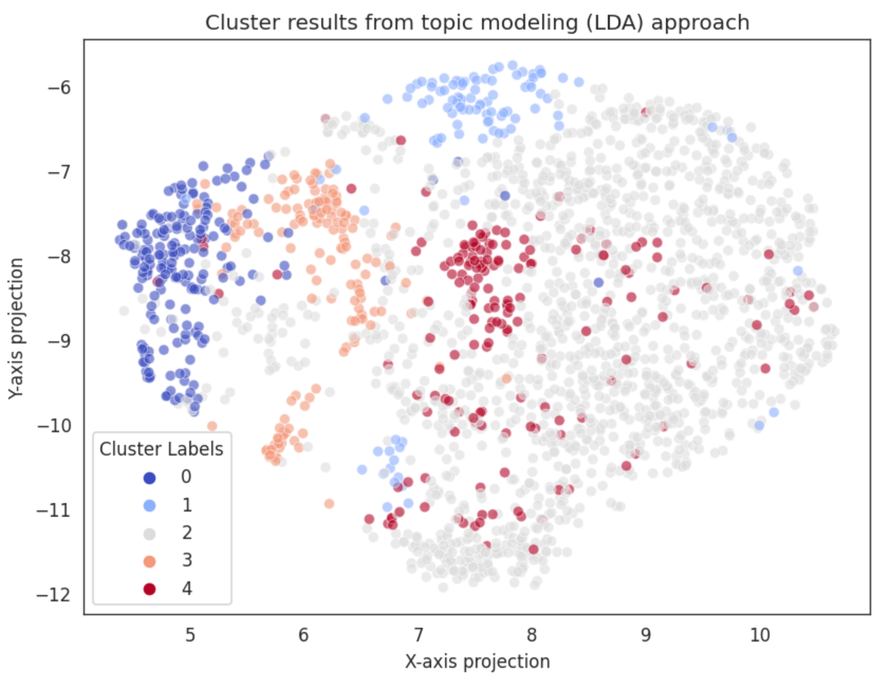
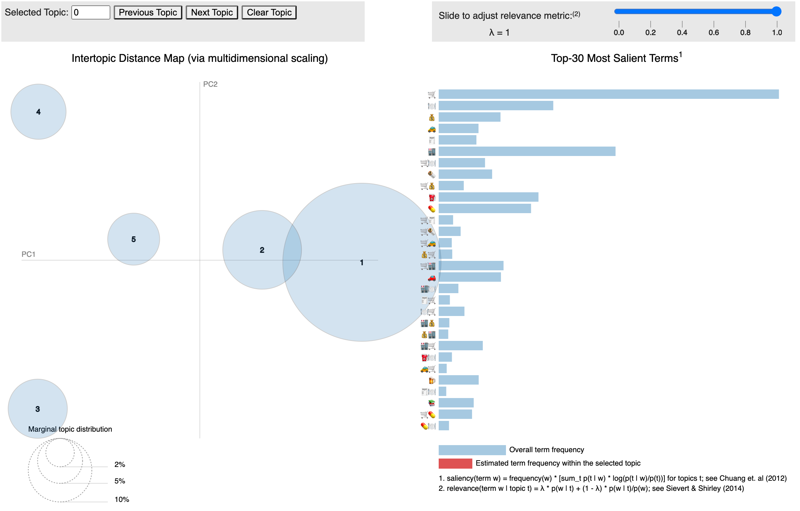
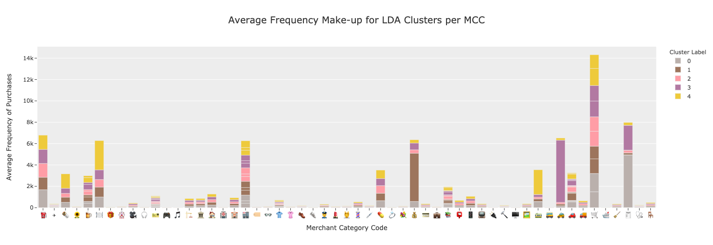

# Identifying Lifestyle Patterns in Credit Card Spending :credit_card:

This project aims at illustrating novel approaches to customer segmentation using Credit Card Records (CCRs) by leveraging modeling techniques similar that of text mining tasks. It is based on the [Sequences of purchases in credit card data reveal lifestyles in urban populations](https://www.nature.com/articles/s41467-018-05690-8) by Clemente Et al, that elucidates patterns in sequences credit card transactions in different merchant categories as a means of uncovering user lifestyles when verifying results on sociodemographic data about the users.

My take on this idea is to develop a clustering mechanism based on `topic modeling` techniques rather than using traditional clustering approaches (based of raw spending). The idea is that sequences of events are more representative of peculiar purchasing patterns, as they do not take into account biases related to the different categories (such as transactions on Airlines being more expensive than those on restaurants), as well as income-related biases (customers spending more or less on their credit cards).

The results were significant, as peculiar spending patterns were found using a `Latent Dirchlett Allocation` model.

# Data Sources
The dataset used for this project was provided by IBM researchers in [this link](https://data.world/ealtman/synthetic-credit-card-transactions). The dataset spans over 15 years of synthetic and realistic credit card records for `2000` distinct users. A [paper](https://arxiv.org/abs/1910.03033) about the dataset is also provided.

# Relevant files
- `configs/`: contains the requirements files used for the project;
- `data/`: data directories for the project (only contain `dvc` references for versioning);
- `models/`: contains the models generated with the project (only contain `dvc` references for versioning);
- `notebooks/1. Data Prep - Historical Transactions.ipynb`: notebook that contains my data preparation steps in `pyspark`;
- `notebooks/2. EDA - Sequences of Transactions.ipynb`: notebook containing my exploratory data analysis about the typical distributions of credit card transaction sequences when compared to text corpora;
- `notebooks/3.1 Model - Spending Lifestyles - LDA and Bag of Words.ipynb`: notebook containing the modeling experiments for the `lda` + `bag-of-words` approach;
- `notebooks/3.2 Model - Spending Lifestyles - User Embeddings.ipynb`: notebook containing the modeling experiments for the `doc2vec` user embeddings + `hdbscan` approach;
- `notebooks/4. Evaluation - Business Perspectives and Model Comparison.ipynb`: notebook comparing model results and interpreting the clusters;

# Technologies used for this project
1. Data Processing: `Apache Spark`, `pandas`, `numpy`;
2. Data Visualization: `plotly`, `seaborn`, `matlotlib`, `pyLDAvis`;
3. Modeling: `gensim`, `umap`, `hdbscan`, `sklearn`;
4. Versioning: `dvc`;

# Overview of Results

## Visualizing the Clusters
The plots below illustrate a few of the results obtained:

> Example of the clusters identified by the LDA topic model over the UMAP projection.

> Inter-topic distance map on PCA projections for the clusters (topics) identified.

> Frequency of transactions in different merchant categories identified in LDA clusters.

## Characterizing the Clusters

### Cluster 0: The Car Owners :car:
These users differ from the other groups as they have regular expenses associated with **owning a car** (`toll fees`, `gas stations`), while spending less in categories that point out to **not owning a car** (`car rentals`, `taxi`, `uber and other ride-sharing services`). Interestingly, they seem comfortable with making online purchases.

### Cluster 1: The Providers :moneybag:
These users are mainly distinguished by the recurrence of costs associated with `money orders and transfers` and quite regular spending behaviors in the other categories. This behavior seems to suggest that they are both spending regularly in order situations but also use `money order and transfer` services more often than the average user. These might be financially maintaining other people (perhaps a son or daughter) abroad or in another context that requires such services.

### Cluster 2: The Average "User" :grimacing:
This group of users represents the regular user base. They don't display any specific distinguishing behavior and are characterizing by using their credit card on a variety of situations. In real world scenarios, this kind of cluster often shows up, and it is a regular pattern. The researchers in the [paper](https://www.nature.com/articles/s41467-018-05690-8) used as motivation for this project also concluded on the existing of an "average" cluster.

### Cluster 3: The Uber Rider :taxi:
This group is mainly characterized by recurrent expenses with **private transportation** (namely `private ride-sharing` and `taxis`), given their spending on different categories and preferred methods of payment (`online` transactions are more significant in this group). They regularly use these alternatives to commute to work in the `mornings` (more frequent use of credit cards in the morning) and to generally get around town (`afternoon` expenses are also significant).

### Cluster 4: The Dine-outs :cocktail:
This cluster is distinguished by the recurrent expenses in **dine-out experiences** (`restaurants`, `fast food places`). They are likely younger people who are living alone, as they still likely don't own a car (regular expenses on `commuting` and `public transportation`).

